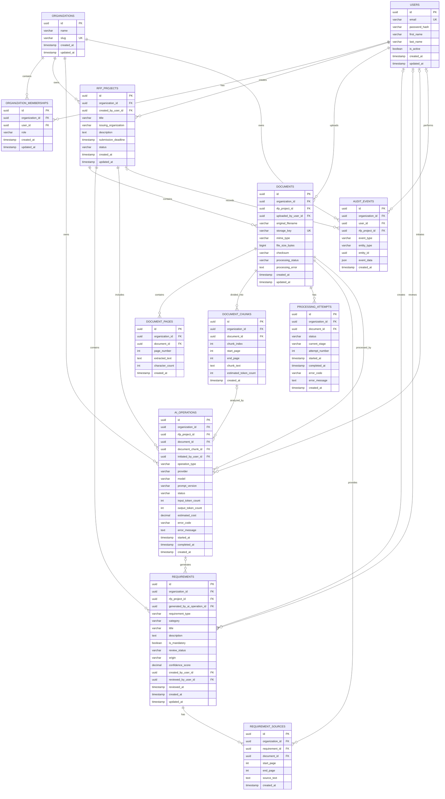

# RFPFlow Milestone 1 Database Schema

## Entity-Relationship Diagram




# Foreign Keys

- `organization_memberships.organization_id` references `organizations.id`.
- `organization_memberships.user_id` references `users.id`.
- `rfp_projects.organization_id` references `organizations.id`.
- `rfp_projects.created_by_user_id` references `users.id`.
- `documents.organization_id` references `organizations.id`.
- `documents.rfp_project_id` references `rfp_projects.id`.
- `documents.uploaded_by_user_id` references `users.id`.
- `document_pages.organization_id` references `organizations.id`.
- `document_pages.document_id` references `documents.id`.
- `document_chunks.organization_id` references `organizations.id`.
- `document_chunks.document_id` references `documents.id`.
- `processing_attempts.organization_id` references `organizations.id`.
- `processing_attempts.document_id` references `documents.id`.
- `requirements.organization_id` references `organizations.id`.
- `requirements.rfp_project_id` references `rfp_projects.id`.
- `requirements.generated_by_ai_operation_id` references `ai_operations.id`.
- `requirements.created_by_user_id` references `users.id`.
- `requirements.reviewed_by_user_id` references `users.id`.
- `requirement_sources.organization_id` references `organizations.id`.
- `requirement_sources.requirement_id` references `requirements.id`.
- `requirement_sources.document_id` references `documents.id`.
- `ai_operations.organization_id` references `organizations.id`.
- `ai_operations.rfp_project_id` references `rfp_projects.id`.
- `ai_operations.document_id` references `documents.id`.
- `ai_operations.document_chunk_id` references `document_chunks.id`.
- `ai_operations.initiated_by_user_id` references `users.id`.
- `audit_events.organization_id` references `organizations.id`.
- `audit_events.user_id` references `users.id`.
- `audit_events.rfp_project_id` references `rfp_projects.id`.

# Unique Constraints

```sql
UNIQUE (
    organization_memberships.organization_id,
    organization_memberships.user_id
);

UNIQUE (
    document_pages.document_id,
    document_pages.page_number
);

UNIQUE (
    document_chunks.document_id,
    document_chunks.chunk_index
);

UNIQUE (
    processing_attempts.document_id,
    processing_attempts.attempt_number
);

UNIQUE (
    requirement_sources.requirement_id,
    requirement_sources.document_id,
    requirement_sources.start_page,
    requirement_sources.end_page
);
````

# Check Constraints

```sql
CHECK (
    document_pages.page_number >= 1
);

CHECK (
    document_pages.character_count >= 0
);

CHECK (
    document_chunks.chunk_index >= 0
);

CHECK (
    document_chunks.start_page >= 1
);

CHECK (
    document_chunks.end_page >= document_chunks.start_page
);

CHECK (
    document_chunks.estimated_token_count >= 0
);

CHECK (
    documents.file_size_bytes >= 0
);

CHECK (
    processing_attempts.attempt_number >= 1
);

CHECK (
    requirements.confidence_score IS NULL
    OR (
        requirements.confidence_score >= 0
        AND requirements.confidence_score <= 1
    )
);

CHECK (
    requirement_sources.start_page >= 1
);

CHECK (
    requirement_sources.end_page >= requirement_sources.start_page
);

CHECK (
    ai_operations.input_token_count IS NULL
    OR ai_operations.input_token_count >= 0
);

CHECK (
    ai_operations.output_token_count IS NULL
    OR ai_operations.output_token_count >= 0
);

CHECK (
    ai_operations.estimated_cost IS NULL
    OR ai_operations.estimated_cost >= 0
);
```

# Suggested Status Values

## Organization Membership Roles

* `organization_admin`
* `proposal_manager`
* `contributor`
* `reviewer`

## RFP Project Status

* `draft`
* `active`
* `archived`

## Document Processing Status

* `uploaded`
* `queued`
* `extracting_text`
* `creating_chunks`
* `extracting_requirements`
* `completed`
* `failed`

## Processing Attempt Status

* `queued`
* `running`
* `completed`
* `failed`
* `cancelled`

## Processing Attempt Stage

* `text_extraction`
* `text_normalization`
* `chunking`
* `requirement_extraction`
* `saving_requirements`

## Requirement Type

* `question`
* `mandatory_requirement`
* `eligibility_requirement`
* `technical_requirement`
* `security_requirement`
* `privacy_requirement`
* `legal_requirement`
* `financial_requirement`
* `required_attachment`
* `deadline`
* `submission_instruction`
* `evaluation_criterion`
* `contractual_requirement`
* `informational`

## Requirement Category

* `company_information`
* `technical`
* `security`
* `privacy`
* `legal`
* `financial`
* `experience`
* `team`
* `project_management`
* `support`
* `submission`
* `other`

## Requirement Review Status

* `pending_review`
* `approved`
* `rejected`
* `needs_clarification`

## Requirement Origin

* `ai`
* `manual`

## AI Operation Type

* `requirement_extraction`

## AI Operation Status

* `queued`
* `running`
* `completed`
* `failed`

# Nullable Fields

The following fields may be null:

* `rfp_projects.description`
* `rfp_projects.issuing_organization`
* `rfp_projects.submission_deadline`
* `documents.processing_error`
* `processing_attempts.started_at`
* `processing_attempts.completed_at`
* `processing_attempts.error_code`
* `processing_attempts.error_message`
* `requirements.generated_by_ai_operation_id` for manually created requirements
* `requirements.confidence_score` for manually created requirements
* `requirements.created_by_user_id` for AI-created requirements
* `requirements.reviewed_by_user_id` before review
* `requirements.reviewed_at` before review
* `ai_operations.document_chunk_id` for operations not tied to one chunk
* `ai_operations.initiated_by_user_id` for automatically started operations
* `ai_operations.input_token_count`
* `ai_operations.output_token_count`
* `ai_operations.estimated_cost`
* `ai_operations.error_code`
* `ai_operations.error_message`
* `ai_operations.started_at`
* `ai_operations.completed_at`
* `audit_events.user_id` for system-generated events
* `audit_events.rfp_project_id` for organization-level events
* `audit_events.entity_id` when an event does not target one specific entity

# Tenant Integrity Rules

Every tenant-owned record must belong to the same organization as its parent records.

Examples:

* A document’s `organization_id` must match its project’s `organization_id`.
* A document page’s `organization_id` must match its document’s `organization_id`.
* A document chunk’s `organization_id` must match its document’s `organization_id`.
* A processing attempt’s `organization_id` must match its document’s `organization_id`.
* A requirement’s `organization_id` must match its project’s `organization_id`.
* A requirement source’s `organization_id` must match both its requirement’s and document’s `organization_id`.
* An AI operation’s `organization_id` must match its project’s, document’s, and document chunk’s `organization_id`.
* An audit event’s project must belong to the event’s organization.

These rules must be enforced through:

* application services
* database constraints where practical
* tenant-isolation integration tests

# Recommended Indexes

```sql
CREATE INDEX idx_memberships_user_id
ON organization_memberships (user_id);

CREATE INDEX idx_memberships_organization_id
ON organization_memberships (organization_id);

CREATE INDEX idx_projects_organization_id
ON rfp_projects (organization_id);

CREATE INDEX idx_projects_status
ON rfp_projects (organization_id, status);

CREATE INDEX idx_documents_project_id
ON documents (rfp_project_id);

CREATE INDEX idx_documents_processing_status
ON documents (organization_id, processing_status);

CREATE INDEX idx_document_pages_document_id
ON document_pages (document_id, page_number);

CREATE INDEX idx_document_chunks_document_id
ON document_chunks (document_id, chunk_index);

CREATE INDEX idx_processing_attempts_document_id
ON processing_attempts (document_id, attempt_number);

CREATE INDEX idx_requirements_project_id
ON requirements (rfp_project_id);

CREATE INDEX idx_requirements_review_status
ON requirements (
    organization_id,
    rfp_project_id,
    review_status
);

CREATE INDEX idx_requirements_category
ON requirements (
    organization_id,
    rfp_project_id,
    category
);

CREATE INDEX idx_requirement_sources_requirement_id
ON requirement_sources (requirement_id);

CREATE INDEX idx_requirement_sources_document_id
ON requirement_sources (document_id);

CREATE INDEX idx_ai_operations_document_id
ON ai_operations (document_id);

CREATE INDEX idx_ai_operations_chunk_id
ON ai_operations (document_chunk_id);

CREATE INDEX idx_ai_operations_status
ON ai_operations (organization_id, status);

CREATE INDEX idx_audit_events_organization_id
ON audit_events (organization_id, created_at);

CREATE INDEX idx_audit_events_project_id
ON audit_events (rfp_project_id, created_at);

CREATE INDEX idx_audit_events_entity
ON audit_events (entity_type, entity_id);
```

# Deletion and Preservation Rules

* Users should normally be deactivated instead of permanently deleted.
* Organizations should be archived or soft-deleted.
* RFP projects should be archived instead of immediately deleted.
* Deleting a document should require an explicit policy for its pages, chunks, requirement sources, AI operations, and generated requirements.
* Requirements should normally be rejected or archived rather than permanently deleted.
* Processing attempts should be preserved for debugging and processing history.
* AI operations should be preserved for traceability, evaluation, and usage tracking.
* Audit events should be append-only.
* Audit events should not be deleted or modified through normal application operations.

```
```
